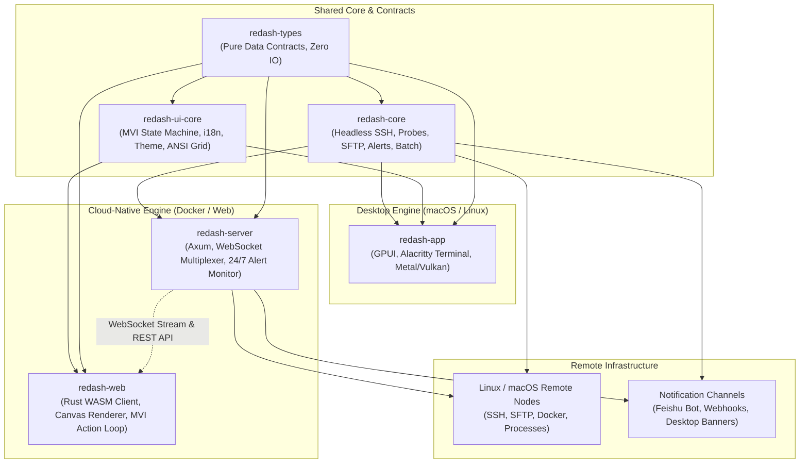
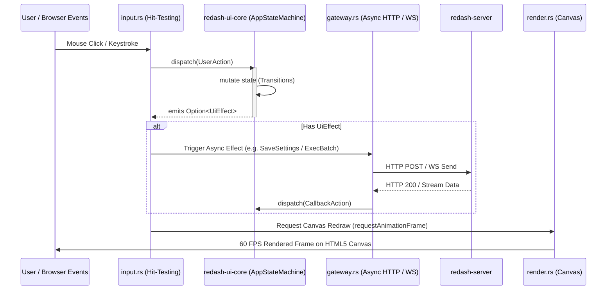
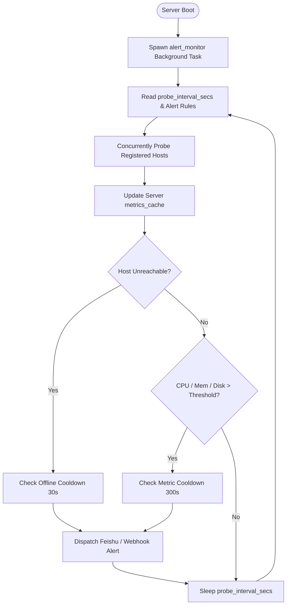

# ReDash Architecture Design Document

<p align="center">
  <strong>High-Performance, Dual-Engine Server Management Workbench in 100% Rust</strong><br>
  <em>Native Desktop (GPUI) + Cloud-Native Web (WebAssembly & Axum)</em>
</p>

---

## 1. System Overview

ReDash is a modern, high-performance server management workbench designed for systems engineers, DevOps practitioners, and developers. Built from the ground up in 100% Rust, ReDash delivers a unified, zero-compromise experience across two deployment modes:

1. **Native Desktop Engine (`redash-app`)**: Leverages GPUI (the GPU-accelerated UI framework powering Zed) for ultra-low latency, 120 FPS rendering, native system keyrings, and multi-split terminal multiplexing.
2. **Cloud-Native Web Engine (`redash-server` + `redash-web`)**: Leverages Axum and WebSockets on the server side, pairing with a 100% Rust WebAssembly client that renders directly into an HTML5 Canvas using a headless MVI (Model-View-Intent) state machine.

Both engines share the exact same underlying headless core (`redash-core`), domain contracts (`redash-types`), and UI logic/theming (`redash-ui-core`).



---

## 2. Workspace Crate Breakdown

ReDash is structured as a tightly decoupled Cargo workspace comprising 6 dedicated crates:

### 2.1 `crates/redash-types` (Domain Contracts)
* **Role**: Pure data models, serialization protocols, and mathematical/formatting helpers.
* **Dependencies**: `serde`, `serde_json`, `uuid` only. **Zero IO, zero platform-specific bindings, `no_std` friendly**.
* **Key Components**:
  * `HostConfig`, `HostId`, `AuthMethod`: Host connectivity credentials and metadata.
  * `NodeMetrics`, `CpuMetrics`, `MemMetrics`, `DiskMetrics`, `NetMetrics`: Live telemetry models.
  * `AppSettings`: Central configuration (probe intervals, thresholds, theme, language, terminal settings).
  * `RemoteFileItem`, `PagedFileResult`: SFTP directory models and file classification.
  * `BatchRunRequest`, `BatchJobResult`, `HostTaskExecution`: Multi-host execution manifests.
  * `DetectedAgent`: AI Agent telemetry extraction (Claude Code, Aider, OpenCode, Codex, Antigravity, Kimi).

### 2.2 `crates/redash-ui-core` (Headless UI Core)
* **Role**: Presentation models, internationalization, theme palettes, and UI state machines.
* **Key Components**:
  * `AppStateMachine`: Headless Model-View-Intent (MVI) state container. Handles actions (`UserAction`), emits side effects (`UiEffect`), and maintains clean state transitions.
  * `ThemePalette`: Unified theme definitions (DarkTech, Cyberpunk Neon, Retro Solarized, High Contrast).
  * `i18n`: Parametric internationalization dictionary supporting `zh-CN`, `en-US`, `zh-TW`, and `ja-JP`.
  * `terminal`: ANSI escape parser, terminal grid buffers, and styled cell runs.

### 2.3 `crates/redash-core` (Headless Backend Engine)
* **Role**: The operational heart of ReDash. Fully testable without any GUI or web runtime.
* **Key Components**:
  * `session::SessionManager`: Connection pooling, SSH connection multiplexing via `russh`, and ProxyJump cycle detection.
  * `probe`: Multi-platform telemetry probes (Linux `/proc/stat` differential CPU, macOS `top` parser, Docker stats, `ss`/`netstat` listening ports).
  * `sftp::SftpSession`: Resilient file operations with atomic replacement (`posix-rename@openssh.com`), exclusive file creation, metadata retention, and failure recovery.
  * `batch::BatchRunner`: Concurrent multi-host script orchestration with timeout bounds, output truncation guards, and cancellation channels.
  * `config::AlertDispatcher`: Multi-channel alerting engine (macOS system notifications, Feishu bot card webhook, generic JSON webhooks) with smart debouncing and cooldown protection.

### 2.4 `crates/redash-app` (Desktop Presentation)
* **Role**: Native macOS and desktop client built on GPUI.
* **Key Components**:
  * `ServerBoxApp`: GPUI application model and window routing.
  * `terminal::view`: Alacritty terminal emulator wrapper with GPU text rendering, split pane trees, search overlay, and URL clicking.
  * `views`: Fleet overview, workbench panels (Docker, processes, network, tunnels, snippets), SFTP file manager, and batch orchestration.

### 2.5 `crates/redash-server` (Web Gateway & Autonomous Engine)
* **Role**: Async HTTP/WebSocket gateway server built on Axum and Tokio.
* **Key Components**:
  * `ws::terminal`: Bidirectional binary/text WebSocket bridge linking the browser PTY to remote SSH channels.
  * `ws::metrics`: Real-time telemetry broadcasting engine streaming live `NodeMetrics` to connected clients.
  * `alert_monitor`: Autonomous 24/7 background monitoring loop. Evaluates host thresholds, manages cooldowns, and dispatches webhook notifications even when no browser is open.
  * `api`: REST endpoints for host CRUD, settings persistence, SFTP proxying, batch job runs, and webhook testing.
  * `web_assets`: Embedded distribution server for the WebAssembly client bundle.

### 2.6 `crates/redash-web` (WebAssembly Client)
* **Role**: 100% Rust WebAssembly client running in the browser.
* **Key Components**:
  * `render`: Immediate-mode canvas rendering pipeline rendering layout, metric sparklines, micro-meters, workbench tabs, and editor modals.
  * `input`: Precision hit-testing, mouse gesture routing, dynamic cursor switching, and keyboard event forwarding.
  * `gateway`: WebSocket client and REST client with asynchronous JS promise bridging.
  * `notifications`: Web Notification API integration for desktop-grade alerts directly from the browser.

---

## 3. Security & Safety Model

ReDash is built with defense-in-depth principles:

### 3.1 Strict Credential Storage
* Passwords and private key passphrases are **never written to unencrypted plaintext disk files**.
* On desktop, credentials are saved exclusively to native secure vaults: **macOS Keychain**, **Linux Secret Service**, or **Windows Credential Manager**.
* Credential persistence failures return explicit errors; they are never downgraded to unauthenticated file dumps.

### 3.2 Host Key & Fingerprint Verification
* Every SSH connection strictly validates `~/.ssh/known_hosts`.
* Host identity changes or untrusted fingerprints are rejected by default with clear fingerprint outputs, preventing Man-in-the-Middle (MITM) attacks.

### 3.3 ProxyJump Loop Protection
* Bastion jump routing supports up to 8 hops with mandatory graph cycle detection before acquiring session locks, preventing deadlocks or recursive connection loops.

### 3.4 SFTP Data Protection
* **Atomic Replacement**: Remote files are updated using OpenSSH `posix-rename@openssh.com` extensions.
* **Failure Recovery**: If a rename fails, both the original file and an untouched recovery copy are preserved; no files are ever deleted during failed save attempts.
* **Exclusive Creation**: New file creation requires exclusive flags to prevent accidental truncation of existing files.
* **Boundary Checks**: Files exceeding the safe in-memory editing ceiling (2 MiB) are restricted to read-only preview mode to prevent data corruption.

---

## 4. State Flow & MVI Architecture (Web)

The Web client implements a unidirectional Model-View-Intent (MVI) architecture:



---

## 5. Autonomous Alert Monitoring Engine

In headless server deployments, alert monitoring runs independently of active web clients:



---

## 6. Build & Quality Verification

The workspace maintains strict quality gates:

```bash
# 1. Formatting
cargo fmt --all -- --check

# 2. Strict Clippy (Zero Warnings)
cargo clippy --workspace --all-targets --locked -- -D warnings
cargo clippy --target wasm32-unknown-unknown -p redash-web --all-targets -- -D warnings

# 3. Comprehensive Tests (280+ Tests)
cargo test --workspace --locked
```
