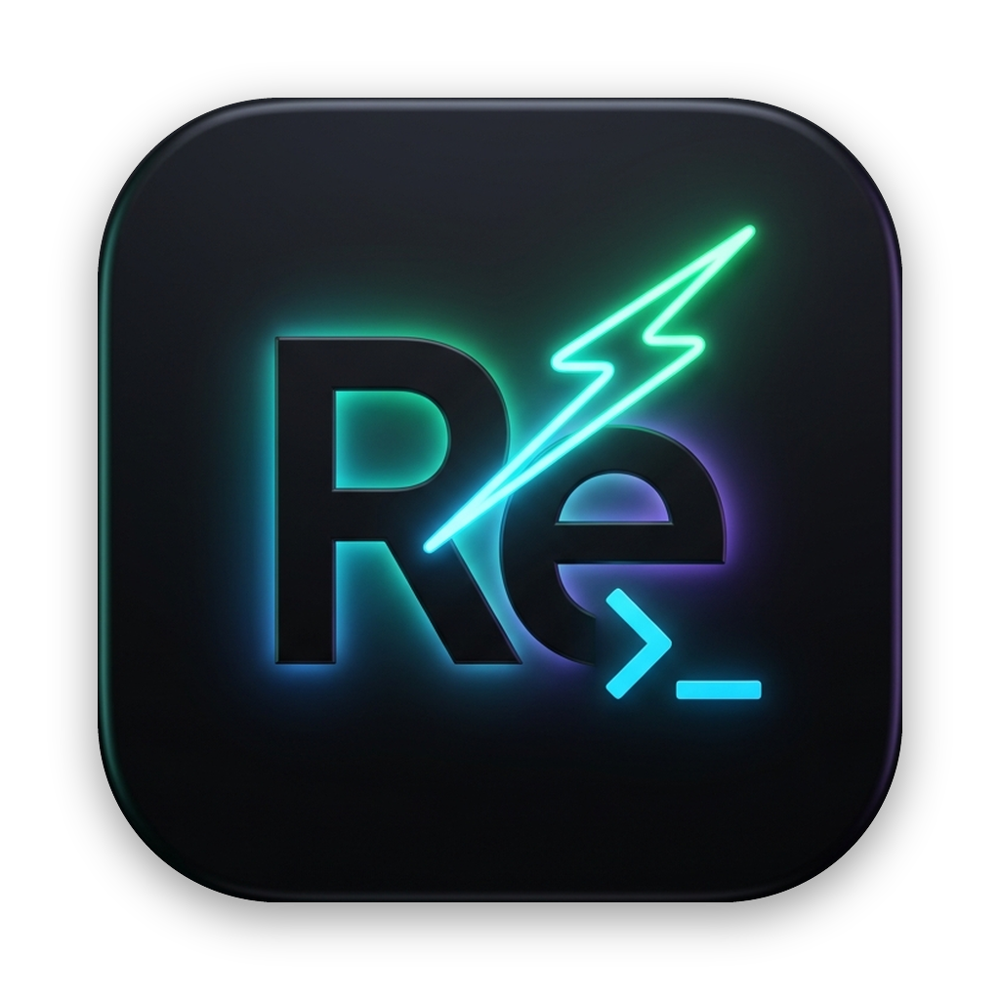
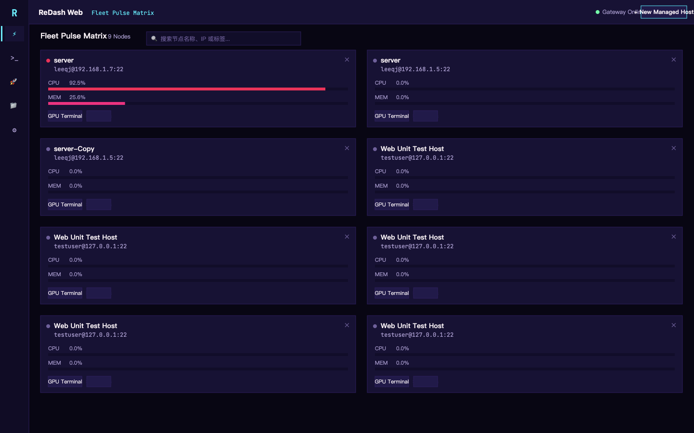
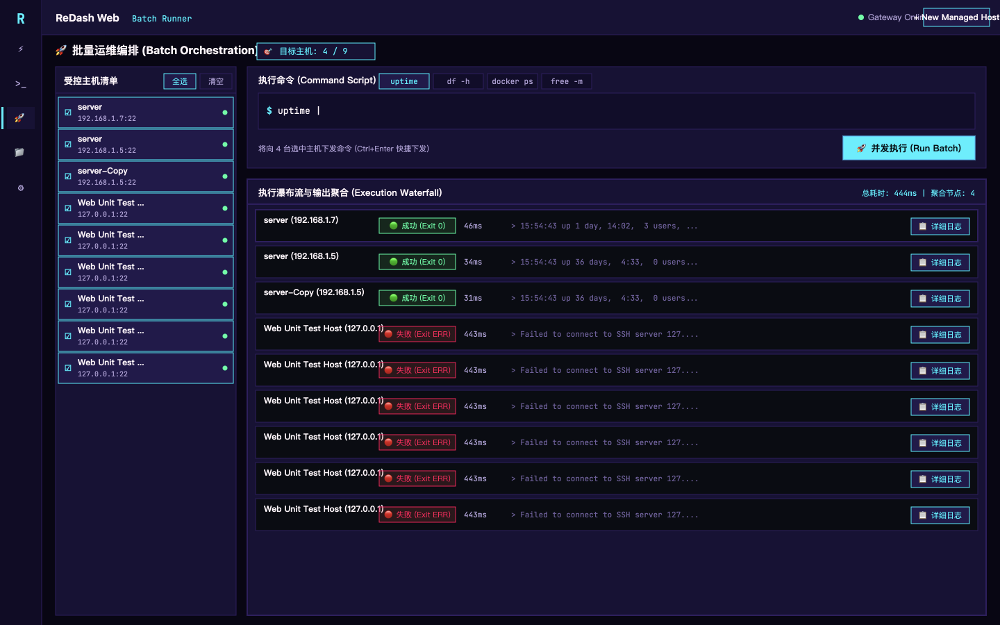
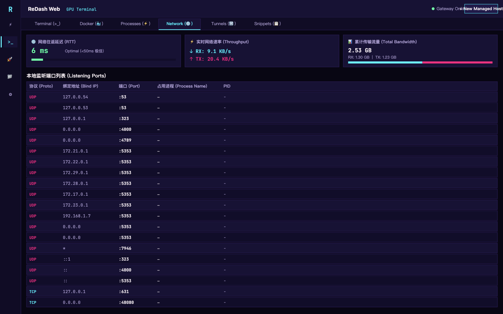
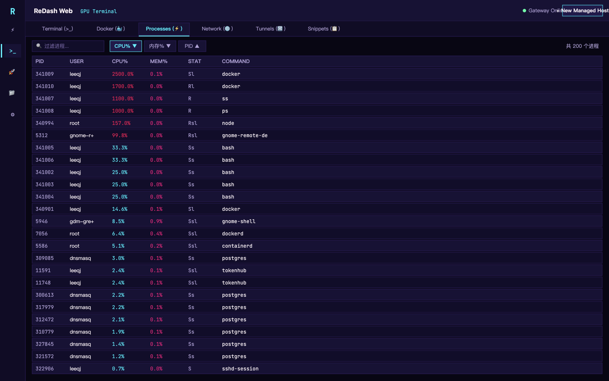
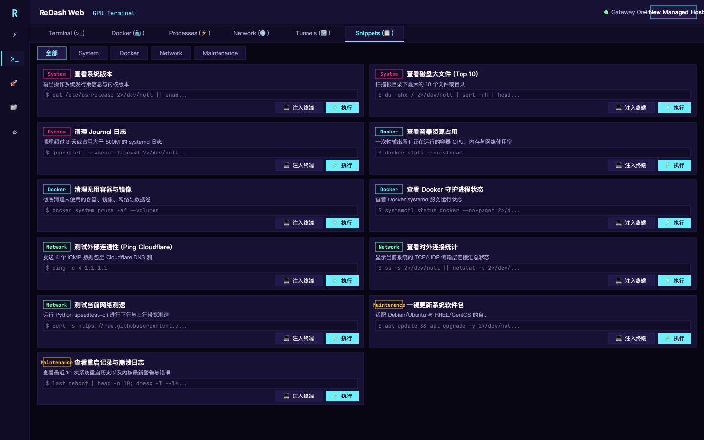
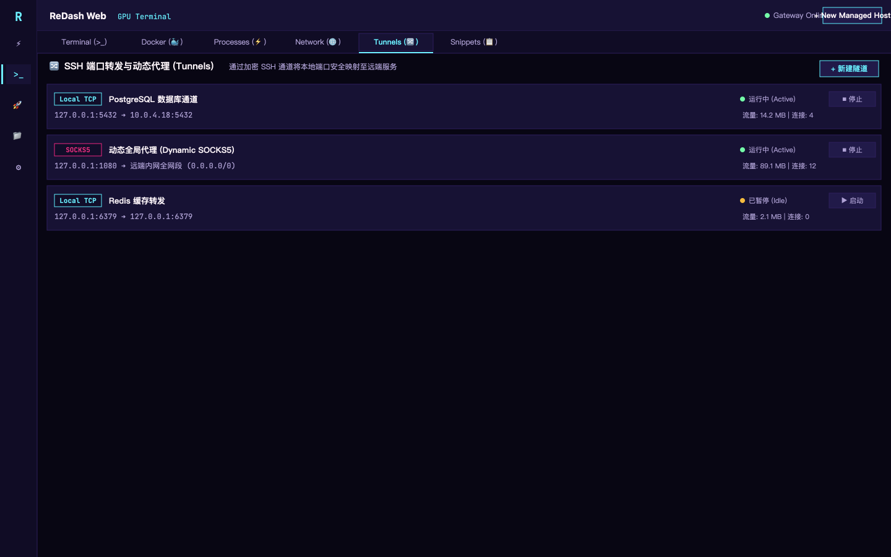
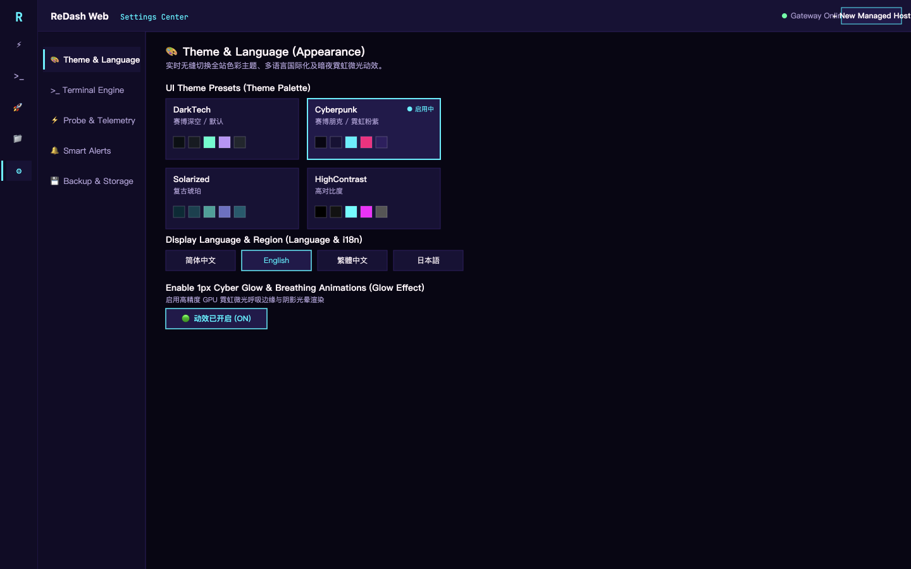
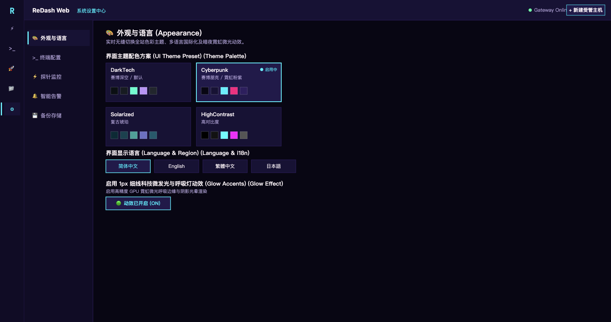

<p align="center">
  
</p>

<h1 align="center">ReDash</h1>

<p align="center">
  <strong>Modern, High-Performance Server Management Workbench in 100% Rust</strong><br>
  <em>Dual-Engine: Native Desktop (GPUI) + Cloud-Native Web (WebAssembly & Axum)</em>
</p>

<p align="center">
  <a href="https://github.com/reways/redash/actions"></a>
  
  
  <a href="LICENSE"></a>
  
</p>

<p align="center">
  <strong>English</strong> | <a href="README_ZH.md">简体中文</a> | <a href="ARCHITECTURE.md">Architecture Design</a>
</p>

---

## Overview

**ReDash** is an ultra-fast, extensible, and dependable server management workbench written entirely in Rust. Designed as a modern alternative to legacy server management tools, ReDash provides an all-in-one suite for remote systems operations: **Fleet Monitoring**, **AI-Assisted SSH Terminal**, **Multi-Panel Workbench (Docker, Processes, Network, Tunnels, Snippets)**, **Resilient SFTP File Manager**, **Multi-Host Batch Orchestration**, and **Autonomous 24/7 Alerting**.

ReDash features a unique **Dual-Engine Architecture**:
1. **Native Desktop Engine (`redash-app`)**: Powered by GPUI (GPU-accelerated, 120 FPS rendering), integrated directly with native OS credential keychains.
2. **Cloud-Native Web Engine (`redash-server` + `redash-web`)**: A headless Axum backend serving an interactive 100% Rust WebAssembly canvas frontend, accessible from any browser without installing local software.

---

## 📸 Showcase

### ⚡ Fleet Telemetry Matrix
> Real-time monitoring across your infrastructure with verified live probes, granular CPU & memory meters, and instant SSH access.

<p align="center">
  
</p>

### 🚀 Multi-Host Batch Orchestration
> Concurrent command dispatch across fleet nodes with real-time execution waterfall, sub-50ms latency tracking, and exit code inspection.

<p align="center">
  
</p>

### 🌐 Workbench: Network & Listening Ports Diagnostics
> Live RTT latency gauge, real-time throughput metrics, and dynamic listening port inspection.

<p align="center">
  
</p>

### ⚡ Workbench: Real-time Process Manager
> Live process inspection sorted by CPU% or Memory%, with instant `kill -15` (graceful) and `kill -9` (force) controls.

<p align="center">
  
</p>

### 📋 Workbench: DevOps Command Snippets & SSH Tunnels
<p align="center">
  
  
</p>

### 🎨 Themes & Multi-Language Internationalization
> Seamless switching between Cyberpunk Neon, DarkTech, Retro Solarized, and High Contrast palettes, with full English, 简体中文, 繁體中文, and 日本語 support.

<p align="center">
  
  
</p>

---

## Key Features

### ⚡ Fleet Telemetry & Monitoring
* **Zero Mocking Policy**: Only displays verified metrics from real remote probes. Missing data or unreachable nodes are honestly reported; no synthetic mock data.
* **Granular Telemetry**: Linux differential `/proc/stat` CPU sampling, macOS `top` CPU sampling, load averages, memory, disk partitions, real-time network speeds, and SSH RTT latency.
* **Host Filtering & Search**: Instant filtering by host name, IP address, tag, or connectivity state.

### 💻 Advanced SSH Terminal & AI HUD
* **High-Speed Rendering**: Alacritty-powered terminal emulator with full ANSI/VT100 support, customizable fonts, cursor styles, and bounded scrollback history.
* **Multi-Split Panes**: Horizontal and vertical split-screen capabilities for multi-server navigation.
* **In-Terminal Search**: Floating `Cmd+F` search bar with real-time match count highlighting and keyboard navigation.
* **AI Agent Detection HUD**: Automatically detects active AI CLI tools (Claude Code, Aider, OpenCode, Codex, Antigravity, Kimi), displaying live status (Thinking, Idle, Done, Waiting for Input), token usage, and cost estimates with one-click `[ Y / N ]` response buttons.

### 🐳 Workbench Panels
* **Docker Container Management**: Live container list with status LEDs, CPU% and memory footprints, port mappings, and container lifecycle actions (Start, Stop, Restart, Remove, Live Logs Modal).
* **Process Manager**: Sortable process list (by CPU%, Memory%, or PID) with search filtering and direct `kill -15` (graceful) / `kill -9` (force) controls.
* **Network & Port Diagnostics**: Real-time listening ports table (TCP/UDP, process name, PID) and network bandwidth meters.
* **SSH Tunnels**: Point-and-click creation of Local Port Forwarding and Dynamic SOCKS5 proxy tunnels.
* **DevOps Snippet Library**: One-click execution or terminal injection of curated system maintenance, Docker, and network diagnostics commands.

### 📁 Resilient SFTP File Manager & In-Place Editor
* **Remote File Browser**: Tree navigation, breadcrumb bar, sorting, and file permissions display.
* **Safety First**: Full UTF-8 code editor with atomic save replacement (`posix-rename@openssh.com`), metadata and permission preservation, and backup recovery copies if a write fails.
* **Exclusive Creation**: Atomic file creation avoiding accidental truncation of existing files.

### 🚀 Multi-Host Batch Orchestration
* **Concurrent Execution**: Run batch shell commands across selected fleet nodes simultaneously.
* **Execution Waterfall**: Live task state tracking (`Success`, `Failed`, `Running`), real process exit codes, duration metrics, and inspection modal for full stdout/stderr streams.
* **Safety Bounds**: Cooperative cancellation channels and output truncation limits to safeguard memory.

### 🔔 Autonomous Alerting & Multi-Channel Notifications
* **Autonomous 24/7 Server Engine**: `redash-server` background alert engine monitors nodes continuously even when the web UI is closed.
* **Multi-Channel Dispatch**:
  * **macOS Local Notifications**: Native desktop banners via `osascript`.
  * **Browser Desktop Notifications**: Web Notification API integration with permission management.
  * **Feishu / Lark Robot Integration**: Formatted card webhook notifications with instant status badges.
  * **Generic Webhooks**: Standard JSON webhook payloads for custom incident response pipelines.
* **Cooldown & Debounce Protection**: 300s metric cooldown and 30s offline cooldown preventing notification storms.
* **One-Click Testing**: Instant test buttons in the Settings panel for Webhook/Feishu and browser notifications.

---

## Workspace Structure

ReDash is architected as 6 modular, decoupled crates:

| Crate | Target | Description |
| :--- | :--- | :--- |
| [`redash-types`](crates/redash-types) | Universal | Pure domain data contracts, serialization, formatting helpers. Zero I/O. |
| [`redash-ui-core`](crates/redash-ui-core) | Universal | Headless UI state machine (MVI), internationalization (i18n), theme palettes, ANSI parser. |
| [`redash-core`](crates/redash-core) | Native | Headless operational engine: SSH connection pool, probes, SFTP, alerts, batch runners. |
| [`redash-app`](crates/redash-app) | Desktop | Native desktop application built on GPUI and Metal/Vulkan. |
| [`redash-server`](crates/redash-server) | Server | Async Axum web server, WebSocket multiplexer, and 24/7 background alert monitor. |
| [`redash-web`](crates/redash-web) | WASM | 100% Rust WebAssembly client rendering into HTML5 Canvas. |

For deep architectural details, see [ARCHITECTURE.md](ARCHITECTURE.md).

---

## Quick Start

### 1. Requirements
* Rust **1.96.0** (pinned via `rust-toolchain.toml`).
* macOS (for native GPUI desktop application) or any modern OS with Docker / Web browser.

### 2. Native Desktop Application (macOS)

```bash
# Build and run directly
cargo run --bin redash

# Or build the macOS release bundle (.app)
./scripts/bundle_mac.sh
open target/release/ReDash.app
```

### 3. Cloud-Native Web Engine (WebAssembly & Axum)

```bash
# One-click build and launch (compiles WASM, starts gateway on http://127.0.0.1:8080)
./scripts/run_web.sh

# Or run the pre-built Docker container
docker build -t redash .
docker run -d -p 8080:8080 --name redash redash
```

Then navigate to `http://127.0.0.1:8080` in your browser.

---

## Security Model

* **Zero Plaintext Secrets**: Passwords and private key passphrases are never saved in plaintext files. Desktop mode strictly leverages macOS Keychain, Linux Secret Service, or Windows Credential Manager.
* **Strict Host Key Verification**: Validates `~/.ssh/known_hosts` prior to authentication. Untrusted or changed keys are rejected.
* **ProxyJump Loop Detection**: Graph cycle detection prevents deadlocks on recursive bastion jump hops (up to 8 hops).
* **Safe Remote Editing**: SFTP atomic replacements ensure files are never left in a corrupted or half-written state.

---

## Quality & Verification

Every commit and pull request must satisfy 100% automated verification:

```bash
# Code style and formatting check
cargo fmt --all -- --check

# Strict Clippy check with zero warnings allowed
cargo clippy --workspace --all-targets --locked -- -D warnings
cargo clippy --target wasm32-unknown-unknown -p redash-web --all-targets -- -D warnings

# Full unit and integration test suite (280+ tests)
cargo test --workspace --locked
```

---

## Contributing

We welcome contributions! Please review our [Contributing Guidelines](CONTRIBUTING.md) and [Architecture Design](ARCHITECTURE.md) before opening a Pull Request.

---

## License

ReDash is open source software licensed under the [Apache License, Version 2.0](LICENSE).
