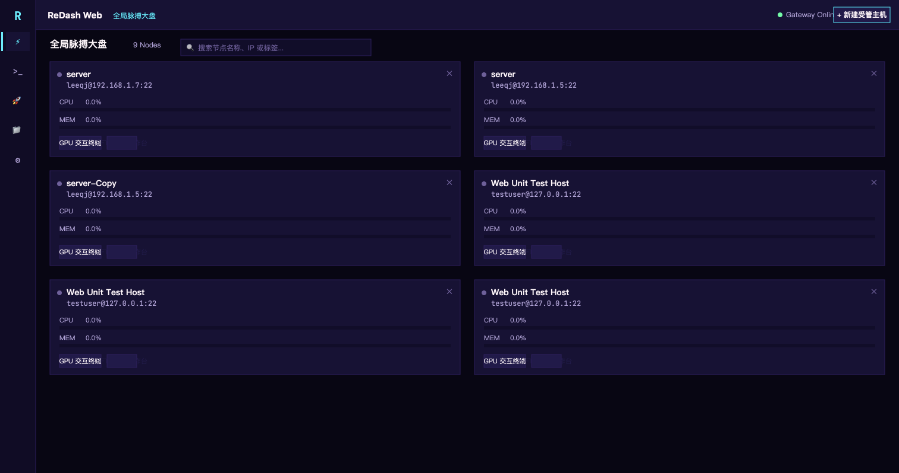

<p align="center">
  
</p>

<h1 align="center">ReDash</h1>

<p align="center">
  <strong>基于 100% Rust 构建的现代化高可靠服务器运维与监控工作台</strong><br>
  <em>双引擎架构：原生桌面端（GPUI 硬件加速） + 云原生 Web 端（WebAssembly & Axum）</em>
</p>

<p align="center">
  <a href="https://github.com/reways/redash/actions"></a>
  
  
  <a href="LICENSE"></a>
  
</p>

<p align="center">
  <a href="README.md">English</a> | <strong>简体中文</strong> | <a href="ARCHITECTURE.md">架构设计文档</a>
</p>

---

## 项目简介

**ReDash** 是专为系统工程师、DevOps 专家与开发者打造的新一代高可靠服务器监控与运维工作台。项目基于 100% 纯 Rust 构建，致力于彻底解决传统运维工具资源占用高、连接不稳定、数据虚假欺骗以及凭据存储不安全的痛点。

ReDash 独创 **双引擎架构（Dual-Engine Architecture）**：
1. **原生桌面端（`redash-app`）**：采用 GPU 硬件加速的 GPUI 框架驱动，支持 120 FPS 超低延迟丝滑交互，与 macOS Keychain 等系统底层凭据库深度集成。
2. **云原生 Web 端（`redash-server` + `redash-web`）**：服务端基于 Axum 与 WebSocket 驱动，前端采用 100% Rust 编译至 WebAssembly 在 HTML5 Canvas 中运行，无需安装客户端，开箱即用。

两套引擎完全共享统一的无头高可靠核心（`redash-core`）、通用数据契约（`redash-types`）与 UI 状态机（`redash-ui-core`）。

---

## 📸 界面展示 (Showcase)

### ⚡ 全局受控节点大盘 (Fleet Pulse Matrix)
> 坚持零伪造原则的真实探针遥测，毫秒级实时反映全网集群节点负载、CPU/内存水位与连通性。

<p align="center">
  
</p>

### 🚀 批量多机并发编排 (Batch Orchestration)
> 一键向数十台服务器并发下发运维指令，毫秒级瀑布流实时聚合各节点退出码、执行耗时与 Stdout/Stderr 日志。

<p align="center">
  
</p>

### 🌐 工作台：实时网络与本地监听端口诊断
> 实时 RTT 往返延迟仪表盘、实时网络吞吐速率统计与动态监听端口（TCP/UDP）解析。

<p align="center">
  
</p>

### ⚡ 工作台：实时进程管理器 (Process Manager)
> 按 CPU%、内存% 或 PID 实时动态排序监控全机进程，支持直接下发优雅终止 (SIGTERM) 与强制终止 (SIGKILL)。

<p align="center">
  
</p>

### 📋 工作台：DevOps 运维代码片段库与 SSH 隧道代理
<p align="center">
  
  
</p>

### 🎨 调色板主题与全站多语言国际化 (i18n)
> 支持赛博朋克霓虹、赛博深空、复古琥珀与高对比度 4 大主题即时切换，全站原生支持简体中文、English、繁體中文与日本語。

<p align="center">
  
  
</p>

---

## 核心功能特性

### ⚡ 真实多维监控（Fleet Telemetry）
* **坚持零伪造原则（Zero Mocking）**：坚决杜绝采集失败生成假数据的虚假欺骗行为。采集失败真实展示原因与最后成功时间，严禁模拟指标参与告警。
* **精准系统度量**：Linux `/proc/stat` 差分 CPU 真实采样、macOS `top` 采样、Load Average、内存、多挂载点磁盘、网络实时上下行速率差分、SSH RTT 真实往返时延。
* **实时检索与过滤**：支持按主机名、IP、标签及在线状态毫秒级模糊检索。

### 💻 极速 SSH 终端与 AI 智能 HUD
* **硬件级渲染体验**：集成 Alacritty 终端引擎，支持完整的 ANSI/VT100 序列、自定义字体、光标样式及有界滚动缓冲区。
* **多分屏工作台**：支持横向与纵向自由分屏，多主机多任务并行导航。
* **终端内毫秒级检索**：浮动式 `Cmd+F` 搜索条，实时匹配高亮与计数，键盘极速导航。
* **AI Agent 智能感知 HUD**：自动嗅探识别终端内的 AI CLI 进程（Claude Code、Aider、OpenCode、Codex、Antigravity、Kimi 等），实时提取思考中、等待输入、Token 用量与消耗成本，支持一键 `[ Y / N ]` 快捷响应。

### 🐳 多功能运维工作台（Workbench Panels）
* **Docker 容器管理**：运行状态 LED、实时 CPU/内存开销、端口映射展示；支持启动、停止、重启、删除及实时日志弹窗。
* **进程管理与排查**：多字段动态排序（CPU% / 内存% / PID），支持进程名快速过滤与 `kill -15`（优雅退出）/ `kill -9`（强制终止）。
* **网络与端口诊断**：实时监听端口表（TCP/UDP、绑定 IP、进程名、PID）及网络吞吐指标。
* **SSH 端口转发与隧道**：图形化一键建立本地端口转发（Local Forwarding）与动态 SOCKS5 代理隧道。
* **DevOps 常用脚本库**：内置系统维护、Docker 清理、网络诊断等预设命令，支持一键注入当前终端或静默执行。

### 📁 高可靠 SFTP 文件管理器与在线编辑器
* **远程目录树浏览**：目录面包屑导航、文件权限（POSIX 模式）、类型与尺寸可视化。
* **安全原子编辑**：内置代码编辑器，编辑上限 2 MiB；采用 `posix-rename@openssh.com` 原语实现保存原子替换，保留原属主与文件权限。
* **保存灾备保护**：重命名失败严禁删除原文件，保留原件与独立备份副本并输出恢复路径。
* **排他性新建文件**：新建文件强制采用排他标志（EXCLUSIVE），避免同名文件截断覆写。

### 🚀 多主机批量并发编排（Batch Orchestration）
* **多节点并发分发**：支持同时勾选多台集群节点并发执行运维脚本。
* **瀑布流执行看板**：实时跟踪各主机状态（`成功`、`失败`、`执行中`），展示真实进程退出码与耗时，支持打开详细日志模态框查看标准输出与错误流。
* **任务边界与取消保护**：作业支持协同式取消与超时控制，有界缓冲区杜绝内存溢出。

### 🔔 全渠道告警与 7x24h 后台自治监控
* **服务端后台自治监控引擎**：`redash-server` 内置独立于 Web 界面的后台常驻监控，即使关闭浏览器也会 7x24 小时自动巡检节点并触发通知。
* **全渠道通知适配**：
  * **macOS 系统通知**：原生桌面系统通知横幅。
  * **浏览器桌面通知**：基于 Web Notification API，网页端指标超限主动唤起系统弹窗。
  * **飞书群机器人**：原生适配飞书交互式消息卡片 Webhook，红绿状态鲜明。
  * **通用 Webhook**：标准 JSON 告警数据包，便于接入钉钉、企业微信或内部监控体系。
* **防轰炸冷却机制**：指标告警 300 秒去抖冷却，主机宕机离线 30 秒冷却。
* **一键连通性测试**：设置界面提供一键测试 Webhook/飞书推送与浏览器通知入口，即时反馈连通状态。

---

## 代码仓库分层架构

ReDash 遵循严密的关注点分离原则，划分为 6 个独立的 Crate：

| Crate 模块 | 运行环境 | 核心职责 |
| :--- | :--- | :--- |
| [`redash-types`](crates/redash-types) | 通用跨平台 | 纯领域数据契约、Serde 序列化、基础计算与格式化。无任何 I/O 依赖。 |
| [`redash-ui-core`](crates/redash-ui-core) | 通用跨平台 | 无头 UI 状态机（MVI 架构）、多语言国际化（i18n）、主题色彩体系、ANSI 栅格解析。 |
| [`redash-core`](crates/redash-core) | 本地后端 | 纯无头业务引擎：SSH 连接池与复用、系统探针、原子 SFTP、告警调度器、批量编排。 |
| [`redash-app`](crates/redash-app) | 桌面原生 | 基于 GPUI 的高性能桌面端应用程序（macOS / Linux）。 |
| [`redash-server`](crates/redash-server) | 服务端 | 基于 Axum 的异步 HTTP/WebSocket 网关，以及 24/7 后台自治告警引擎。 |
| [`redash-web`](crates/redash-web) | WASM 浏览器 | 100% 纯 Rust WebAssembly 客户端，在 HTML5 Canvas 中渲染整个应用界面。 |

详细技术架构图与设计决策请参阅 [ARCHITECTURE.md](ARCHITECTURE.md)。

---

## 快速上手与运行

### 1. 环境准备
* Rust 工具链：**1.96.0**（通过 `rust-toolchain.toml` 锁定版本）。
* macOS 平台（用于体验 GPUI 桌面端）或任意主流 Linux/Windows/Docker 环境（用于运行 Web 端）。

### 2. 运行原生桌面端（macOS）

```bash
# 启动桌面开发版本
cargo run --bin redash

# 或一键打包并打开原生 macOS 应用包（ReDash.app）
./scripts/bundle_mac.sh
open target/release/ReDash.app
```

### 3. 运行云原生 Web 端（WebAssembly + Axum）

```bash
# 一键编译 WASM 并启动网关服务（默认监听 http://127.0.0.1:8080）
./scripts/run_web.sh

# 或者使用 Docker 快速部署
docker build -t redash .
docker run -d -p 8080:8080 --name redash redash
```

启动后在浏览器中访问 `http://127.0.0.1:8080` 即可使用完整的 Web 运维工作台。

---

## 安全设计原则

1. **凭据安全绝对底线**：密码与私钥口令绝不存储于未加密明文文本中，桌面端严格依赖系统级凭据库（macOS Keychain、Linux Secret Service、Windows Credential Manager）。
2. **严格的主机密钥校验**：连接前严格校验 `~/.ssh/known_hosts`，拒绝任何未知或发生变动的服务端公钥，防止中间人拦截（MITM）。
3. **跳板机环路安全检测**：ProxyJump 支持多达 8 跳链路，并在获取连接锁前强制完成有向图环路检测，从源头杜绝连接死锁。
4. **防御性文件替换**：远程文件编辑优先使用原子重命名替换，重命名失败保留原件并生成灾备副本，杜绝破坏性写操作。

---

## 质量验证与自动化标准

项目遵循极其严苛的代码工程规范：

```bash
# 1. 代码格式一致性检查
cargo fmt --all -- --check

# 2. 严格 Clippy 静态检查（零警告通过）
cargo clippy --workspace --all-targets --locked -- -D warnings
cargo clippy --target wasm32-unknown-unknown -p redash-web --all-targets -- -D warnings

# 3. 自动化测试套件（280+ 个单元与集成测试 100% 通过）
cargo test --workspace --locked
```

---

## 开源贡献指南

欢迎参与 ReDash 的开发与建设！在提交 Pull Request 之前，请阅读我们的 [贡献指南（CONTRIBUTING.md）](CONTRIBUTING.md) 和 [架构设计说明（ARCHITECTURE.md）](ARCHITECTURE.md)。

---

## 开源协议

ReDash 依据 [Apache-2.0 开源许可证](LICENSE) 发布。
