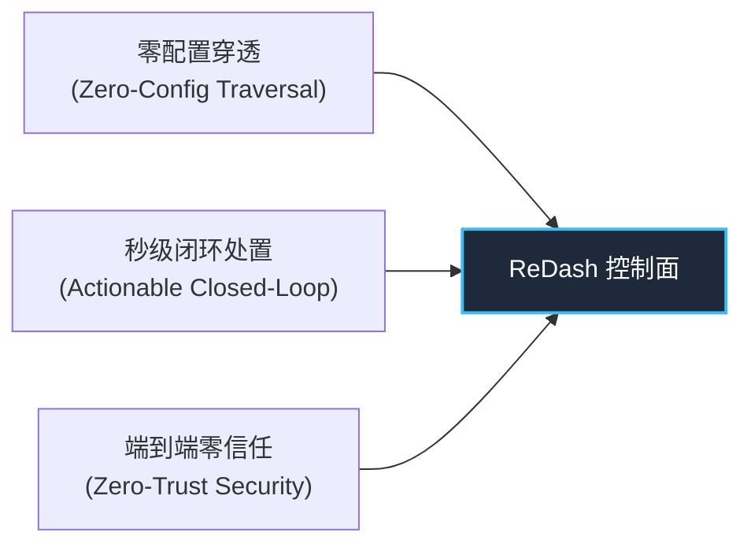
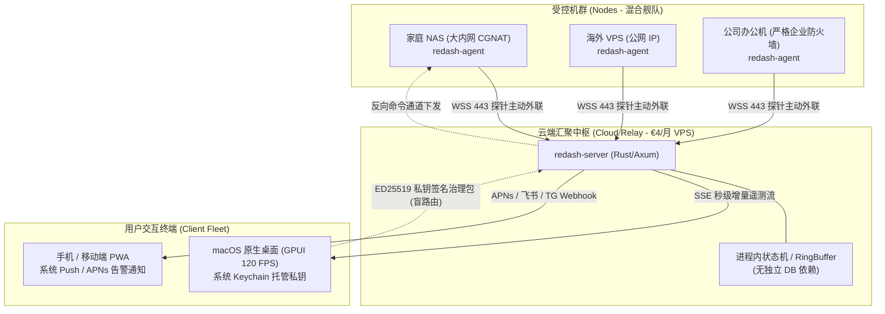
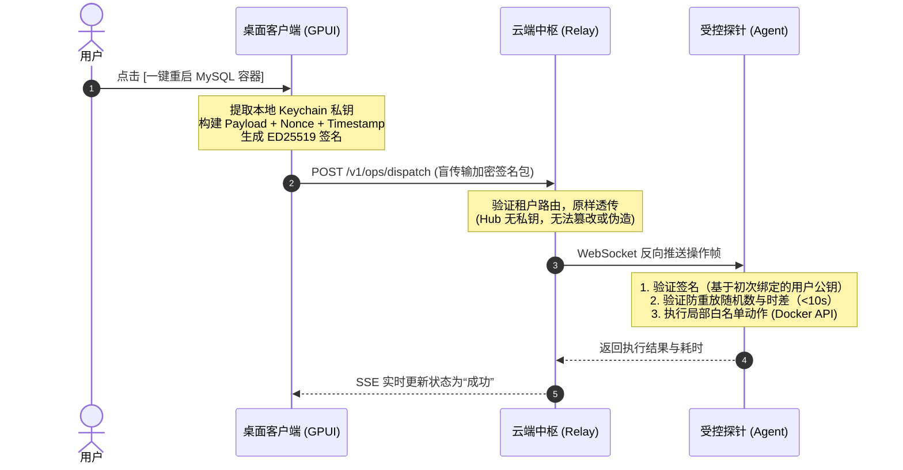
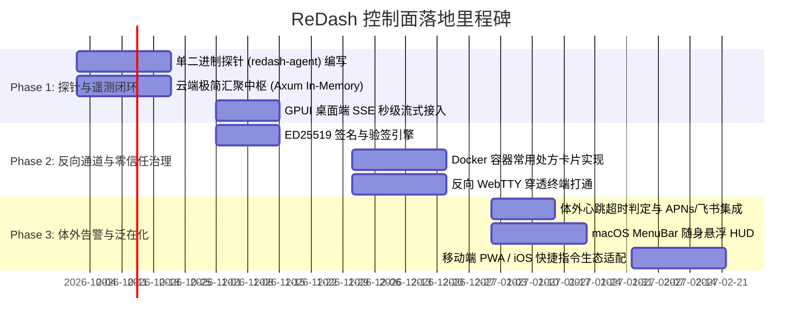

# 次世代 ReDash 产品详细方案：轻量级个人云原生控制面（Personal Cloud Control Plane）

---

## 1. 执行摘要与战略背景

在针对终端运维（SSH）与服务器监控领域的全面调研中，当前市场呈现两个极端的同质化困境：
1. **SSH 客户端赛道严重内卷**：传统工具（Xshell、SecureCRT、FinalShell）与现代高颜值工具（Termius、WindTerm、Warp）在连接管理与终端仿真上已陷入边际递减，核心开发者受制于 dotfiles/tmux 习惯，迁移意愿低。
2. **Homelab / 服务器监控赛道虚假繁荣**：以 Homepage、Beszel、Uptime Kuma 为代表的面板层出不穷，但普遍受制于“只看不治”、“自托管套娃”、“内网公网拓扑割裂”三大结构性通病。

### 核心破局点定位
本项目（ReDash）不再单纯定位为“SSH 终端客户端”或“只读仪表盘”，而是升级定义为：
> **基于 100% Rust 构建、具备零侵入内网穿透能力与端到端零信任安全机制的“个人云原生控制面（Personal Cloud Control Plane）”。**

实现从**感知（Telemetry）**到**诊断（Diagnosis）**再到**处置（Remediation）**的 3 秒极速闭环。

---

## 2. 目标用户画像与核心价值主张

### 2.1 目标用户画像
* **独立开发者与数字游民（Indie Hackers）**：名下拥有 2~10 台不同云厂商的低配 VPS（用于运行个人网站、Bot、数据库、反向代理）。
* **Homelab 与 NAS 极客**：拥有家庭内网小主机（N100、群晖、TrueNAS、软路由），常年受困于 NAT 穿透与外网监控。
* **中小型团队 Tech Lead / SRE**：嫌 Prometheus+Grafana 过重、嫌传统运维面板（宝塔/1Panel）侵入性过强、有洁癖的高要求技术人员。

### 2.2 核心价值主张（The 3 Pillars）



1. **零配置拓扑无关穿透**：探针主动出站（Outbound 443 WSS），彻底终结 Tailscale、FRP、动态域名与公网端口暴露的折腾史。
2. **秒级看查治一体化**：从“指标变红”到“执行预设安全处方（如 Docker 重启、清理日志）”仅需 3 秒，告别机械式登录与查命令。
3. **体外独立监护与零信任**：监控与被控宿主机彻底物理隔离；云端仅作为盲转发管道，私钥在端侧，云端被攻破也无法伪造治理指令。

---

## 3. 系统整体架构设计

系统由三大部分组成：**端侧工作台（Client App）**、**云端汇聚枢纽（Cloud Relay Hub）**、**受控机超轻探针（Micro-Agent）**。

### 3.1 架构全景拓扑



---

## 4. 数据流与控制流协议规范

系统严格遵循“数据流向上、控制流向下、职责单向解耦”的设计哲学：

### 4.1 遥测流（Telemetry Stream）：极致轻量与自适应节流
* **连接协议**：探针通过 `wss://hub.yourdomain.com/v1/agent/stream` 保持持久长连接。
* **数据格式**：二进制或精简 JSON 结构体：
  ```rust
  struct NodeTelemetry {
      node_id: [u8; 16],
      timestamp: u64,
      cpu_usage_pct: f32,
      mem_used_bytes: u64,
      mem_total_bytes: u64,
      net_rx_rate: u32,
      net_tx_rate: u32,
      disk_max_pct: u8,
      containers_summary: Vec<ContainerBrief>, // 仅含状态与名
  }
  ```
* **自适应节流机制**：
  * **静默稳态**：指标变动 $< 2\%$ 且无告警时，降低上报频次至 10 秒/次，或仅发送 32 字节空心跳。
  * **突发激增**：检测到 CPU/内存超过警戒线或容器状态突变时，瞬间提频至 1 秒/次。
  * **客户端感知**：桌面端最小化/息屏时，向 Hub 发送 Pause 指令，Hub 停止向下游推送 SSE 流，极大节约流量。

### 4.2 治理流（Remediation Stream）：端到端零信任签名体系
这是阻断“云端攻破连带受控机被黑”的最核心防线：



---

## 5. 核心功能场景与交互方案

### 5.1 场景一：态势感知随身 HUD（Menubar-First）
* **视觉隐形**：日常状态下无需打开全屏大窗口，常驻 macOS 菜单栏或 Windows 托盘。
* **状态心跳**：以极简水滴或单线脉冲展示全网健康度（绿/黄/红）。
* **一瞥下钻（Hover & Drill-down）**：鼠标滑过，弹出 GPUI 原生微型面板，直观展现排名前 3 的高负载机器及异动指标。

### 5.2 场景二：Docker 容器一等公民与“处方化”微运维
针对 80% 的 Homelab/VPS 运维诉求聚焦在容器这一事实，提供卡片式原子操作：
* **容器矩阵看板**：状态指示灯（运行中/异常退出/重启中）、实时 CPU/内存占用水位、暴露端口。
* **常用处方一键触发**：
  * `[平滑重启容器]`：调用 Docker Engine API。
  * `[滚动更新]`：拉取最新 tag 并在旧实例退出后启动新实例。
  * `[日志速览]`：查看崩溃前最后 50 行 stderr 输出，省去敲 `docker logs` 的繁琐过程。

### 5.3 场景三：常见系统故障自治排查与安全清理
* **磁盘空间暴涨**：
  * 探针上报检测到 `/` 分区 $>95\%$；
  * App 弹窗提示症结：`Docker 卷与日志占用 32.4 GB`；
  * 提供安全处方：`[一键轮转并清理系统日志 (journalctl -200M)]`、`[一键清理废弃镜像 (docker system prune)]`。
* **失控进程急救**：
  * 识别死循环或高消耗进程；
  * 提供 `[优雅退出 (SIGTERM)]` 与 `[强制终止 (SIGKILL)]`。

### 5.4 场景四：零端口暴露的应急穿透终端（Reverse WebTTY）
当图形化处方不足以解决深度问题时：
* 用户在 App 点击“连接应急终端”；
* 探针在受控机本地直接启动 `/bin/sh`（或 `/bin/bash`）并绑定到内部 PTY；
* 字符流通过既有的 WSS 443 反向加密通道双向传输；
* **成果**：在公网 IP 为 0、端口暴露为 0、不配置任何跳板机的前提下，依然拥有原生低延迟控制台。

### 5.5 场景五：体外独立 ICU 监护
* 彻底摆脱“宿主机挂死导致监控容器一同失联”的自托管悖论。
* 云端 Hub 每 5 秒对长连接进行心跳探测，一旦探测超时（如 15 秒无响应），立即判定失联。
* 通过 Apple APNs / 移动端通知 / 飞书机器人发出紧急推送：
  > *“【物理离线告警】您的节点 [Home-NAS] 失去心跳连接，可能遭遇电源故障或网络断开。”*

---

## 6. 成本、资源与可行性精算账本

按支撑 **1,000 名活跃用户**（管理约 **4,000 个受控节点**）的模型进行资源核算：

### 6.1 资源吞吐测算表

| 维度 | 单节点指标 | 4,000 节点全网汇总 | 应对方案与开销 |
| :--- | :--- | :--- | :--- |
| **请求吞吐 (QPS)** | 3 秒上报 1 次 | 约 1,333 RPS | Rust (Axum) 异步 IO，单机 2 核 CPU 占用率 $<15\%$ |
| **运行内存 (RAM)** | 单节点状态缓存约 20 KB | 约 80 MB 纯数据 | Rust 进程内 `DashMap`，无需外挂独立 Redis 进程 |
| **上行带宽 (Ingress)** | 单次包约 400 字节 | 约 4.2 Mbps | 云主机自带流量包可完全覆盖 |
| **下行推送 (Egress)** | 100 在线用户并发 SSE | 约 0.2 ~ 0.5 Mbps | 智能节流（客户端息屏时中断下行） |
| **推送通道费用** | 苹果 APNs / 飞书 / TG | 无限制 | **0 元**（均为官方开放免费接口） |

### 6.2 硬件选型与真实费用清单

* **推荐机型**：Hetzner Cloud (CPX21 - 3 核 AMD, 4GB 内存, 20TB 流量包)
* **实际支出**：**€4.50 ~ €7.00 / 月（约合人民币 35 ~ 55 元/月）**
* **国内备选**：腾讯云/阿里云 轻量应用服务器（2核4G，约合 35~50 元/月）
* **结论**：**个人完全能够轻松承担，甚至低于日常宽带费用。**

---

## 7. 分阶段落地实施路线图（Roadmap）



---

## 8. 竞争壁垒与开源交付策略

1. **开源双轨制**：
   * **社区版（自托管）**：探针与 Server 枢纽 100% 开源，用户可自行在自备小机上一键部署（`docker run redash-hub`），零信任、零成本。
   * **官方托管通道（Free/Pro SaaS）**：为不愿维护中心服务器的用户提供官方公共盲转发枢纽，基于端到端签名机制建立绝对的安全背书。
2. **技术品牌护城河**：
   * 区别于市面上充斥的 Electron 与 Web 慢应用，打出 **“100% Pure Rust + GPUI 原生硬件加速 + 2MB 极小静态探针”** 的极致硬核标签，迅速在 V2EX、Reddit（r/selfhosted）、Hacker News 树立口碑。
